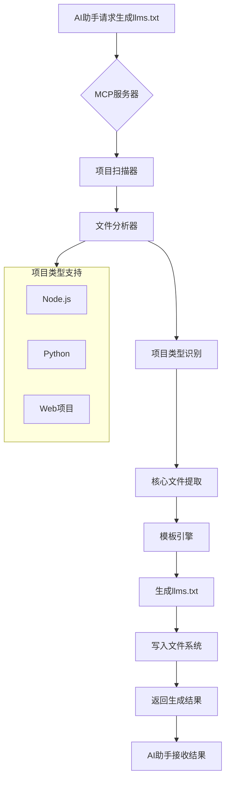

# 产品需求文档 (PRD): LLMS.TXT MCP 服务器

## 1. 项目概述
- **项目名称**: LLMS.TXT MCP 服务器
- **项目目标**: 开发一个本地MCP服务器，自动为Web项目生成标准化的llms.txt文档，提升AI助手对项目内容的理解效率
- **目标用户**: 开发者、技术文档工程师、AI助手用户
- **核心价值**: 通过结构化文档优化AI理解，减少上下文干扰，提升开发效率

## 2. 需求边界与约束
- **功能边界**: 
  - ✅ 支持常见Web项目（Node.js、Python等）
  - ✅ 生成基础概览版llms.txt文档
  - ✅ 使用Python和mcp库实现
  - ✅ 支持stdio传输机制
  - ❌ 不支持多项目批量处理
  - ❌ 不支持高级自定义模板
  - ❌ 不支持详细API文档生成

- **技术约束**: 
  - Python 3.8+ 环境
  - mcp库依赖
  - 本地文件系统读写权限
  - stdio通信协议

- **资源约束**: 
  - 单开发者实现
  - 2周开发周期
  - 基础功能优先

- **合规约束**: 
  - 遵循llms.txt文件标准
  - 符合MCP协议规范
  - 确保文件操作安全性

## 3. 系统架构与数据模型

### 核心业务流程图


## 4. 功能需求 (P0/P1/P2分级)

### P0需求 (核心功能，必须实现)
- **需求编号**: MCP-001
- **需求描述**: 作为开发者，当我在项目目录中调用MCP工具时，系统应自动扫描项目结构并生成基础llms.txt文档
- **验收标准**: 
  - 成功识别项目类型
  - 生成符合标准的Markdown格式文档
  - 包含项目基本信息和核心文件列表
  - 通过stdio返回生成结果
- **依赖关系**: Python环境、mcp库

- **需求编号**: MCP-002
- **需求描述**: 作为用户，我希望MCP服务器支持常见Web项目类型识别（Node.js、Python）
- **验收标准**: 
  - 正确识别package.json（Node.js）
  - 正确识别requirements.txt（Python）
  - 正确识别项目根目录结构
- **依赖关系**: 文件系统访问权限

### P1需求 (重要功能)
- **需求编号**: MCP-003
- **需求描述**: 作为用户，我希望llms.txt包含项目依赖和关键配置信息
- **验收标准**: 
  - 包含项目主要依赖包信息
  - 包含关键配置文件说明
  - 包含主要功能模块描述
- **依赖关系**: MCP-001完成

### P2需求 (增强功能)
- **需求编号**: MCP-004
- **需求描述**: 作为高级用户，我希望支持更多项目类型和自定义选项
- **验收标准**: 
  - 支持至少5种项目类型
  - 提供基础配置选项
  - 支持简单的模板定制
- **依赖关系**: MCP-002完成

## 5. 非功能需求
- **性能要求**: 单个项目扫描生成时间 < 3秒
- **安全要求**: 仅限本地文件系统操作，无网络权限
- **可用性要求**: 命令行工具，易于IDE集成
- **可靠性要求**: 错误处理完善，避免进程崩溃

## 6. 验收标准
- **功能验收**: 所有P0需求实现并通过测试
- **性能验收**: 响应时间符合要求
- **质量验收**: 代码符合PEP8规范，测试覆盖率 > 80%
- **文档验收**: 提供完整的API文档和使用说明

## 7. 技术实现要点

### 核心工具定义
```python
@mcp.tool()
def generate_llms_txt(directory: str = ".") -> Dict[str, Any]:
    """
    为指定项目生成llms.txt文档
    
    参数:
        directory: 项目目录路径，默认为当前目录
    
    返回:
        包含生成状态和文件路径的字典
    """
    # 实现逻辑
```

### 项目识别逻辑
- Node.js项目: 检测package.json文件
- Python项目: 检测requirements.txt或pyproject.toml
- Web项目: 检测常见Web框架特征文件

### 文档模板结构
```markdown
# {项目名称}

> {项目简要描述}

## 核心文件与目录

- [package.json](package.json): 项目配置和依赖管理
- [src/](src/): 源代码目录
- [README.md](README.md): 项目说明文档

## 项目信息

- 项目类型: {项目类型}
- 主要技术栈: {技术栈}
- 核心依赖: {主要依赖}

## 快速开始

<!-- 在此添加项目使用说明 -->
```

## 8. 开发计划

### 第一阶段 (Week 1)
- [ ] MCP服务器框架搭建
- [ ] stdio通信协议实现
- [ ] 基础项目扫描功能
- [ ] Node.js项目识别

### 第二阶段 (Week 2)  
- [ ] Python项目识别
- [ ] llms.txt模板引擎
- [ ] 错误处理机制
- [ ] 测试用例编写
- [ ] 文档编写

## 9. 风险与缓解

- **风险**: 项目类型识别准确率
  - **缓解**: 采用多重特征检测，提供手动覆盖选项

- **风险**: 文件权限问题
  - **缓解**: 完善的错误处理和权限检查

- **风险**: MCP协议兼容性
  - **缓解**: 严格遵循协议规范，充分测试

## 10. 成功指标

- ✅ 项目类型识别准确率 > 95%
- ✅ llms.txt生成成功率 > 98% 
- ✅ 用户满意度评分 > 4/5
- ✅ 平均响应时间 < 2秒
- ✅ 错误率 < 1%